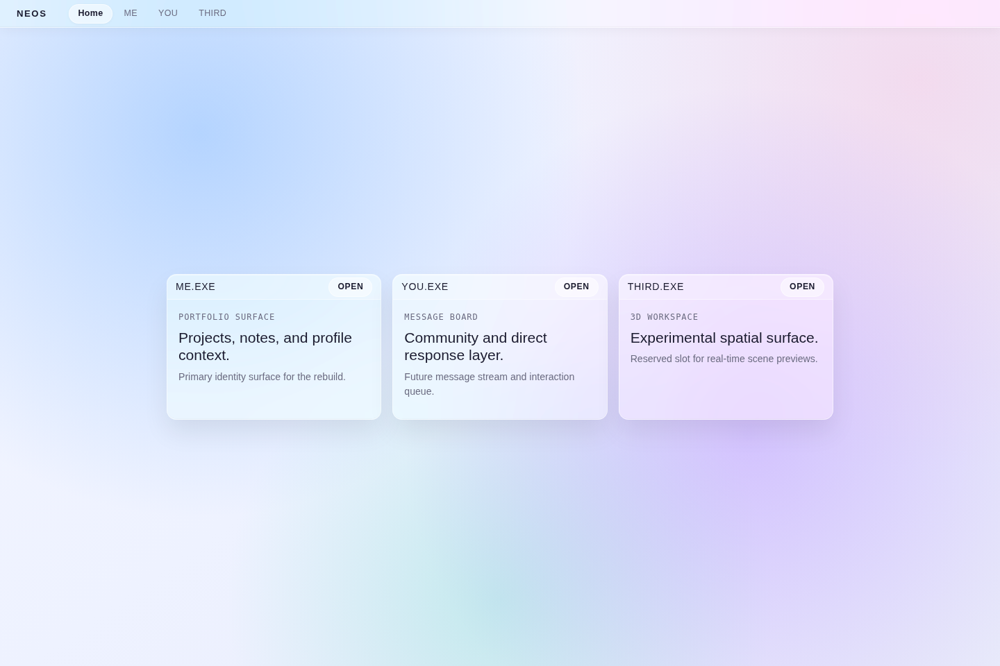

# Stage 1A (Original) — HOME-Led Shell Pass

## What we were trying to do

Turn the starter shell into a recognizable NEOS landing experience before the strict v2 shell reset was enforced.

## What changed

- Introduced a HOME-led landing composition with channel selector behavior.
- Kept ME.EXE as the contained taskbar-owning OS boundary.
- Added a more expressive visual style than the starter scaffold.
- Captured the first milestone screenshot used in the timeline.

## Why this matters

This snapshot is an important historical checkpoint.

It shows the product direction before the later SHELL-01A reset to a stricter
desktop-first architecture. Keeping this image and write-up preserves the
decision trail instead of rewriting history.

## In plain English

This was the first time NEOS looked like a deliberate product instead of a
starter page. It is not the current shell model, but it is part of the project
story and should stay visible in the timeline.

## What the UI looked like

The screen presented a HOME-focused composition with channel selection
affordances and a stronger visual identity than the initial scaffold.



## Important code

```tsx
export function SiteShell(): ReactElement {
  return (
    <main className="neosShell">
      <ChannelBar />
      <div className="channelViewport">
        <ChannelView channel={activeChannel} onNavigate={setActiveChannel} />
      </div>
    </main>
  );
}
```

## Code explained simply

The shell treated HOME as the primary arrival surface and used channel
switching as the core navigation model.

## Notes

- This milestone is kept as historical progression.
- Later milestones may replace architecture, but they must not delete prior
  timeline evidence.
