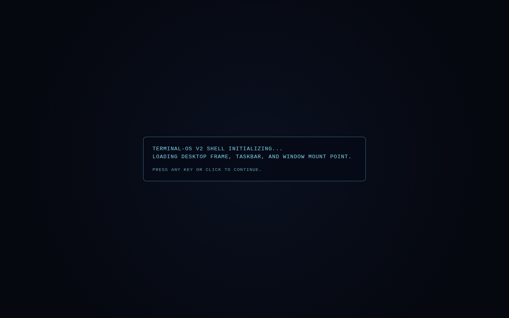
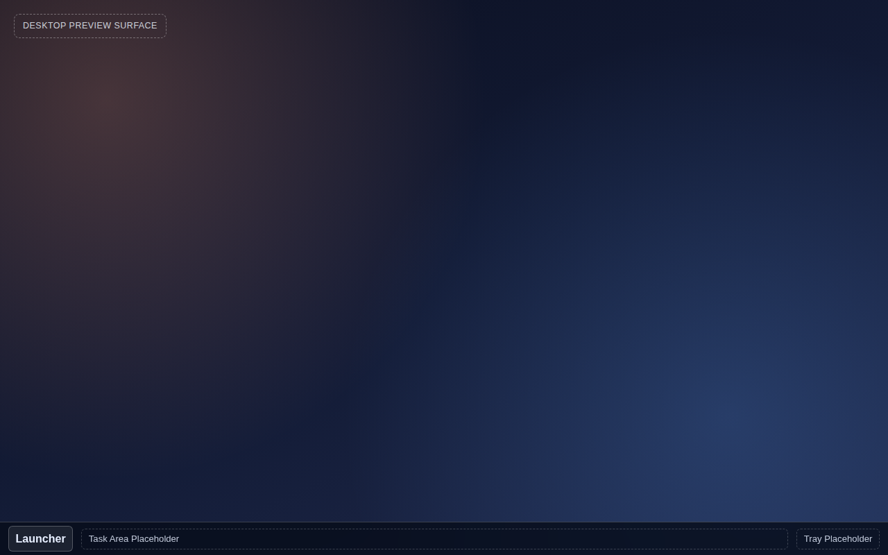

# SHELL-01A — Desktop Shell Frame + Boot Gate + Static Taskbar

**Date:** 2026-03-14
**Lane:** SHELL-DESKTOP
**Status:** Complete — validated by Gemini, approved by Claude

---

## What we were trying to do

Start the Terminal-OS v2 rewrite with a real shell foundation.

The goal was not to build the full OS yet — it was to establish the correct structural skeleton that everything else will grow from: a desktop container, a boot gate, a static taskbar, and a placeholder window mount point.

## What changed

- Created `src/desktop/Desktop.tsx` — the root shell container that owns the layer stack
- Created `src/desktop/desktopStore.ts` — full Zustand-compatible store implementing the `DesktopStore` contract
- Created `src/desktop/BootSequence.tsx` — a fullscreen overlay that gates the shell until dismissed
- Created `src/desktop/Taskbar.tsx` — static taskbar strip with placeholder launcher, task area, and tray
- Created `src/desktop/Wallpaper.tsx` — lightweight static background gradient
- Created `src/core/types.ts` — `Z_LAYER` constants and `SHELL_Z_INDEX` CSS values
- Created `src/core/OsBootstrap.ts` — root component that mounts the desktop without blocking on VFS
- Created `src/windowing/WindowLayer.tsx` — empty placeholder div for future window mounting
- Updated `src/main.tsx` to mount `OsBootstrap` instead of the old placeholder

## Why this matters

This is the point where the v2 rewrite became a real OS shell, not just a scaffold.

The layer ordering is now locked in code. The desktop/channel boundary is enforced from day one. The store contract is implemented in full even though most fields are not yet active — because the spec requires contract-first, not grow-as-you-go.

Every future milestone (window manager, launcher, app runtime) has a correct foundation to attach to.

## In plain English

Think of this like framing a building. The walls aren't finished, the rooms aren't furnished, and the plumbing isn't connected — but the structural frame is up, in exactly the right position, in exactly the right order.

The boot sequence greets you. Once you dismiss it, the desktop appears: a gradient wallpaper, a preview surface label, and a static taskbar at the bottom. No apps yet. No windows yet. But the shell is real.

## What the UI looked like

**Boot sequence — the gate that runs on first load:**



**Desktop shell — after boot is dismissed:**



The wallpaper is a dark gradient. The top-left corner shows a "Desktop Preview Surface" label — a placeholder for future desktop icons and channel panels. The bottom taskbar shows the Launcher button, task area placeholder, and tray placeholder.

## Important code

```tsx
// Desktop.tsx — the layer stack
export function Desktop(): JSX.Element {
  const bootComplete = useDesktopStore((store) => store.bootComplete);

  return (
    <main aria-label="Desktop shell" style={desktopStyle}>
      <Wallpaper />
      <div style={previewSurfaceStyle}>...</div>
      <WindowLayer />
      <Taskbar />
      {!bootComplete ? <BootSequence /> : null}
    </main>
  );
}
```

This is the complete layer order defined in the spec. Wallpaper at the bottom, window mount point in the middle, taskbar above, boot overlay at the top. Every z-index is driven by the `SHELL_Z_INDEX` constants, not by magic numbers.

```ts
// OsBootstrap.ts — does not block on VFS
export function OsBootstrap(): ReactElement {
  useEffect(() => {
    prefetchVfsNonBlocking(); // fire and forget
  }, []);
  return createElement(Desktop);
}
```

The boot sequence does not wait for the filesystem to load. VFS prefetch fires in the background. Apps handle their own loading states — the shell itself is always responsive.

## Validation

- Architecture validated by Claude (spec guard) before implementation
- Implementation validated by Gemini (validator) after Codex delivered
- Build passed: `npm run build`
- Playwright screenshots captured at this milestone
